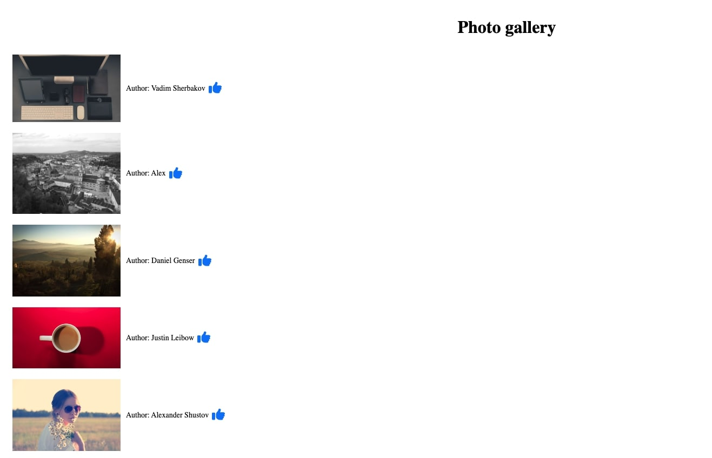

# Photo gallery

Create a single page, Infinite scroll implementation based on paginated
JSON feeds

You are provided with the following feeds that provide data to render a bunch of articles

https://picsum.photos/v2/list?page=1  
https://picsum.photos/v2/list?page=2  
https://picsum.photos/v2/list?page=3  
 
And so on

**(If you run into a CORS issue, you can perhaps try adding a proxy to your package.json)**

## Task

Render a 1 column view, by using the `download_url` and `author` to render
something like this

When the user reaches the bottom of the page, pull in data from the next page
https://picsum.photos/v2/list?page=2 and add the new
items to the existing list of articles and keep doing this until you reach a page with has no
more data.

Next to each photo, add a thumbs up icon and a count(initialised to 0). Use fontawesome icon for thumbs up. On clicking this icon, increase the count. The count should be increase as many clicks performed.

Add necessary css to make the UI looks similar to the image shown. 

Please create a public git repository and push your code. Share the link for the repository with us over email.
